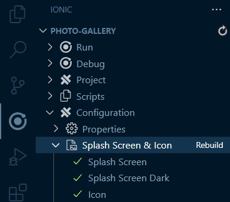
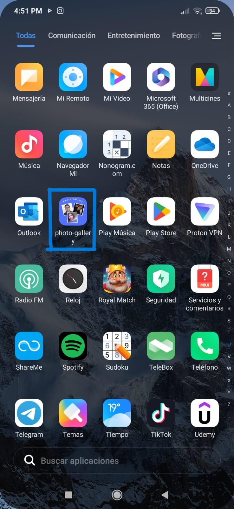
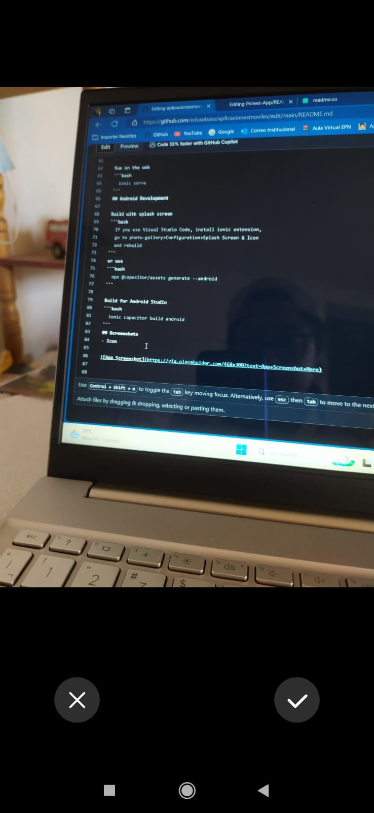
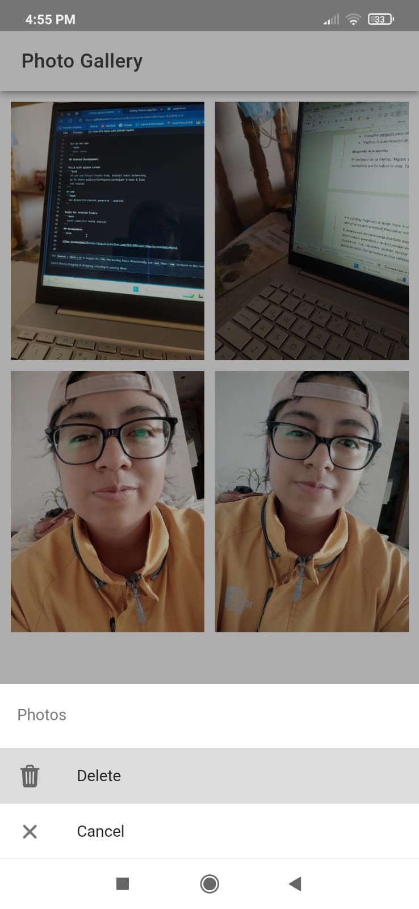
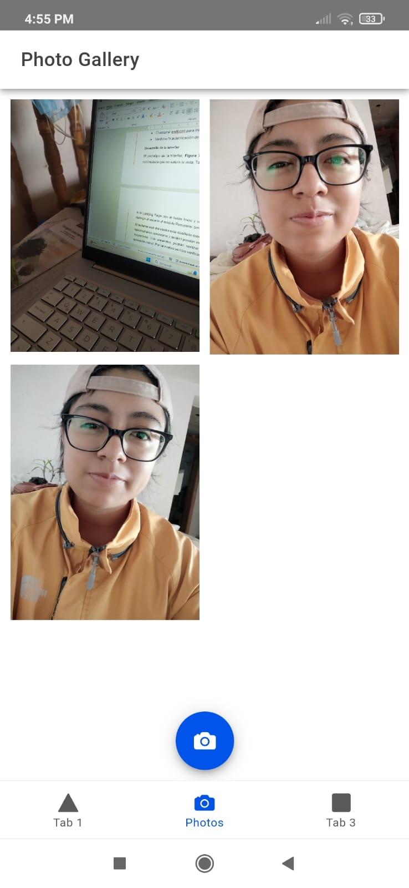

# Photo Gallery

Aplicación móvil con splash screen para tomar, guardar y borrar fotos.

#### APK: Descarga el [.apk](photo-gallery/src/assets/app-debug.apk)

## Autores

- Eduardo Almachi - [@edusebass](https://github.com/edusebass)
- Brittany Espinel - [@brittanypallasco2003](https://github.com/brittanypallasco2003)
- Melany Sangucho - [@SanguchoMela](https://github.com/SanguchoMela)

<!--
## Cómo crear el proyecto

Instala ionic
```bash
  npm i -g @ionic/cli
```

Crea el proyecto
```bash
  ionic start photo-gallery tabs --type=angular --capacitor
```

Cambia el directorio
```bash
  cd photo-gallery
```

Instala las librerías necesarias
```bash
  npm install @capacitor/camera @capacitor/preferences @capacitor/filesystem
```
```bash
  npm install @ionic/pwa-elements
```

Genera una carpeta para las dependencias
```bash
  ionic g service services/photo
```
-->

## Cómo correr el proyecto
Instala ionic
```bash
  npm i -g @ionic/cli
```

Clona este repositorio
```bash
  git clone https://github.com/edusebass/aplicacionesmoviles.git
```

Cambia el directorio
```bash
  cd aplicacionesmoviles/photo-gallery
```

Instala los paquetes
```bash
  npm i
```

Correlo en la web
```bash
  ionic serve
```

## Despliegue en Android

Construye con la splash screen
```bash
  Si utilizas Visual Studio Code, instala la extensión de Ionic,
  ve a photo-gallery>Configuration>Splash Screen & Icon 
  y reconstruye
```
  <p align="center">
    
  </p>

o usa el comando: 
```bash
  npx @capacitor/assets generate --android
```

Construye con Android Studio
```bash
  ionic capacitor build android
```

## Capturas de funcionamiento

- Icono
  <p align="center">
    
  </p>

- Splash screen
  <p align="center">
    
  </p>

- Tomar fotos
  <p align="center">
    
  </p>

- Eliminar fotos
  <p align="center">
    
  </p>

- Galería de Fotos
  <p align="center">
    
  </p>

## Conclusiones
-
- La extensión de Ionic para Visual Studio Code reduce de forma significativa la generación y construcción de un splash screen y el ícono de la apliación. En lugar de escribir algún comando solo se debe hacer clic en el Rebuild de la opción Splash Screen & Icon y listo.
- La redacción de un buen archivo .md, que incluya instrucciones claras y evidencias de funcionamiento, facilita la reutilización del código y ayuda a cualquier interesado a correr el programa en un entorno local.
